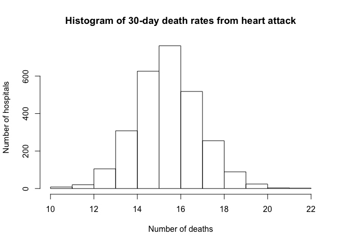

R Programming - Assigment Three
================
Kevin Roche
21/06/2021

# Part One

## Plot the 30-day mortality rates for heart attack

Read the outcome data into R via the read.csv function and look at the
first few rows.

``` r
## Read in data
outcomeData <- read.csv("Data/outcome-of-care-measures.csv", colClasses = "character")

## Only including relevant columns
outcomeSubset <- subset(outcomeData, select = c(2, 7, 11, 17, 23))
        
## Rename columns for simplicity
colnames(outcomeSubset) <- c("hospital", "state", "heart attack",
                                     "heart failure", "pneumonia")

## Check first few rows
head(outcomeSubset, 5)
```

    ##                           hospital state  heart attack heart failure pneumonia
    ## 1 SOUTHEAST ALABAMA MEDICAL CENTER    AL          14.3          11.4      10.9
    ## 2    MARSHALL MEDICAL CENTER SOUTH    AL          18.5          15.2      13.9
    ## 3   ELIZA COFFEE MEMORIAL HOSPITAL    AL          18.1          11.3      13.4
    ## 4         MIZELL MEMORIAL HOSPITAL    AL Not Available          13.6      14.9
    ## 5      CRENSHAW COMMUNITY HOSPITAL    AL Not Available          13.8      15.8

Make a simple histogram of the 30-day death rates from heart attack.

``` r
## Make histogram
outcomeData[, 11] <- as.numeric(outcomeData[, 11])
hist(outcomeData[, 11], main = "Histogram of 30-day death rates from heart attack", ylab = "Number of hospitals", xlab = "Number of deaths")
```

<!-- -->

Normally distributed - interesting\!

# Part Two

## Finding the best hospital in a state

Write a function called best that take two arguments: the 2-character
abbreviated name of a state and an outcome name. The function reads the
outcome-of-care-measures.csv file and returns a character vector with
the name of the hospital that has the best (i.e. lowest) 30-day
mortality for the specified outcome in that state. The hospital name is
the name provided in the Hospital.Name variable. The outcomes can be one
of “heart attack”, “heart failure”, or “pneumonia”. Hospitals that do
not have data on a particular outcome should be excluded from the set of
hospitals when deciding the rankings.

If there is a tie for the best hospital for a given outcome, then the
hospital names should be sorted in alphabetical order and the first
hospital in that set should be chosen (i.e. if hospitals “b”, “c”, and
“f” are tied for best, then hospital “b” should be returned).

The function should check the validity of its arguments. If an invalid
state value is passed to best, the function should throw an error via
the stop function with the exact message “invalid state”. If an invalid
outcome value is passed to best, the function should throw an error via
the stop function with the exact message “invalid outcome”.

``` r
## Function 
best <- function(state, outcome) {
        
        ## Read outcome data
        outcomeData <- read.csv("Data/outcome-of-care-measures.csv", colClasses = "character", header=TRUE)
        
        ## Big file - let's only keep relevant variables
        outcomeSubset <- subset(outcomeData, select = c(2, 7, 11, 17, 23))
        
        ## Rename columns for simplicity
        colnames(outcomeSubset) <- c("hospital", "state", "heart attack",
                                     "heart failure", "pneumonia")
        
        ## Ensure state and outcome are valid
        if(!state %in% outcomeSubset[, "state"]) {
                stop("invalid state")
        } else if(!outcome %in% c("heart attack", "heart failure", "pneumonia")){
                stop("invalid outcome")
        } 
        
        ## If valid, get best hospital
        else {
                matchState <- which(outcomeSubset[, "state"] == state) # Choose obs with selected state
                extractState <- outcomeSubset[matchState, ] # Extracting obs for the called state
                numOutcome <- as.numeric(extractState[,outcome]) # Convert to numeric
                minVal <- min(numOutcome, na.rm = TRUE) # Calculate min value
                fnResult  <- extractState[, "hospital"][which(numOutcome == minVal)] # Store result
                bestHospital  <- fnResult[order(fnResult)] # Order result
        }
        return(bestHospital)
}
```

``` r
## Check results
best("TX", "heart attack") # Correct: "CYPRESS FAIRBANKS MEDICAL CENTER"
```

    ## [1] "CYPRESS FAIRBANKS MEDICAL CENTER"

``` r
best("TX", "heart failure") # Correct: "FORT DUNCAN MEDICAL CENTER"
```

    ## [1] "FORT DUNCAN MEDICAL CENTER"

``` r
best("MD", "heart attack") # Correct: "JOHNS HOPKINS HOSPITAL, THE"
```

    ## [1] "JOHNS HOPKINS HOSPITAL, THE"

``` r
best("MD", "pneumonia") # Correct: "GREATER BALTIMORE MEDICAL CENTER"
```

    ## [1] "GREATER BALTIMORE MEDICAL CENTER"

Function returns correct results.
